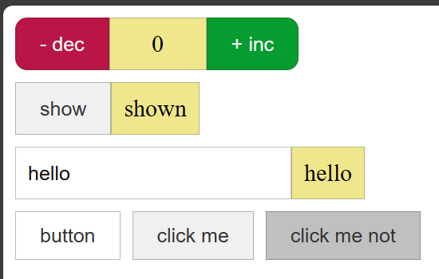

# fin.js

A frontend JavaScript library to manage execution of javascript code inside HTML attributes and bodies.

## Sample

### v1.1

`fin-1.1` + `fin-components-1.0`



```html
<!DOCTYPE html>
<html lang="en">
<head>
  <meta charset="UTF-8">
  <meta name="viewport" content="width=device-width, initial-scale=1.0">
  <title>Demo</title>
  <script src="js/fin-components-1.0.js"></script>
  <script src="js/fin-1.1.js"></script>
</head>
<body>
  <!-- root -->
  <div id="root"
    $let-count="{0}"
  >
    <FlexBox $style="{{
        gap: '.5rem',
        flexDirection: 'column'
      }}"
    >
      <Flexbox>
        <CounterDec></CounterDec>
        <Display $style="{{
            width: '3rem', 
            justifyContent: 'center'
          }}"
        >{$count}</Display>
        <CounterInc></CounterInc>
      </Flexbox>
  
      <FlexBox $:value value="hello">
        <MInput 
          $value="{$value()}" 
          $onInput="{$:value(this.output.value)}"
        >
        </MInput>
        <Display $style="{{padding: '.5rem'}}">{$value()}</Display>
      </FlexBox>
  
      <FlexBox $style="{{ gap: '.5rem' }}">
        <Button></Button>
        <Button $onCLick="{alert('hello')}">click me</Button>
        <Button disabled>click me not</Button>
      </FlexBox>
    </FlexBox>
  </div>

  <!-- components -->
  <div id="components">
    <!-- Box -->
    <Box component="Box" is="div"></Box>
    <InlineBox component="InlineBox" is="div"></InlineBox>
    <FlexBox component="FlexBox" extends="Box"></FlexBox>
    <InlineFlexBox component="InlineFlexBox" extends="InlineBox"></InlineFlexBox>
    <!-- MInput -->
    <MInput component="MInput" is="input" 
      type="text" title="input"
    ></MInput>
    <Display component="Display" extends="InlineFlexBox"></Display>
    <!-- Button -->
    <Button component="Button" is="button" type="button" title="button">button</Button>
    <!-- Counter -->
    <Counter component="Counter" extends="Button"></Counter>
    <!-- CounterInc -->
    <CounterInc component="CounterInc" extends="Counter"
      $onClick="{$:count++}"
    >+ inc</CounterInc>
    <!-- CounterDec -->
    <CounterDec component="CounterDec" extends="Counter"
      $onClick="{$:count--}"
    >- dec</CounterDec>
  </div>
  <!-- components' styles -->
  <style>
    /* ... */
  </style>
  <script>
    const componentStore = new ComponentStore(
      document.getElementById('components'),
      document.getElementById('root')
    ).removeDefinitionElement();
  </script>
  <script>
    const fin = new Fin(document.getElementById('root'));
    const rootContext = fin.updateRoot();
</script>
</body>
</html>
```

```css
  /* <style> */
    * {
      transition: 100ms;
    }
    .Box {
      display: block;
    }
    .InlineBox {
      display: inline-block;
    }
    .FlexBox {
      display: flex;
    }
    .InlineFlexBox {
      display: inline-flex;
    }
    .MInput {
      margin: unset;
      padding: .5rem;
      border: 1px solid #7777;
    }
    .Display {
      margin: unset;
      padding: .5rem;
      border: 1px solid #7777;
      background-color: khaki;
    }
    .Button {
      margin: unset;
      padding: .5rem 1rem;
      appearance: none;
      border: 1px solid #3335;
      background-color: #f0f0f0;
      color: #333;
    }
    .Button:hover:not(:active):not(:disabled) {
      background-color: hsl(from #f0f0f0 h s calc(min(l*1.1, 1)));
    }
    .Button:disabled {
      background-color: hsl(from #f0f0f0 h s calc(l*.8));
    }
    .Counter {
      color: white;
    }
    .CounterInc {
      background-color: #079c2f;
      border-radius: 0 .5rem .5rem 0;
    }
    .CounterInc:hover:not(:active):not(:disabled) {
      background-color: hsl(from #079c2f h calc(s*.7) calc(min(l*1.4, 1)));
    }
    .CounterDec {
      background-color: #b91546;
      border-radius: .5rem 0 0 .5rem;
    }
    .CounterDec:hover:not(:active):not(:disabled) {
      background-color: hsl(from #b91546 h calc(s*.7) calc(min(l*1.4, 1)));
    }
  /* </style> */
```

### v1.0

```html
<head> 
    <title>fin-1.0 demo</title>
    <script src="js/fin-1.0.js"></script>
</head>
<body> 
    <main id="root"
        fin-let-name="Adam"
        fin-let-message="{'Hello '+$name}"
        fin-class="{'border p-2'}"
        >
        <button 
            fin-let-count="{0}" 
            fin-onclick="{this.set('count', $count+1)}"
            ><p>count: {$count}</p></button>
        <p>{$message}</p>
    </main>
    <script>
        const [root, rootContext] = fin.update(document.getElementById('root'));
    </script>
</body>
```
